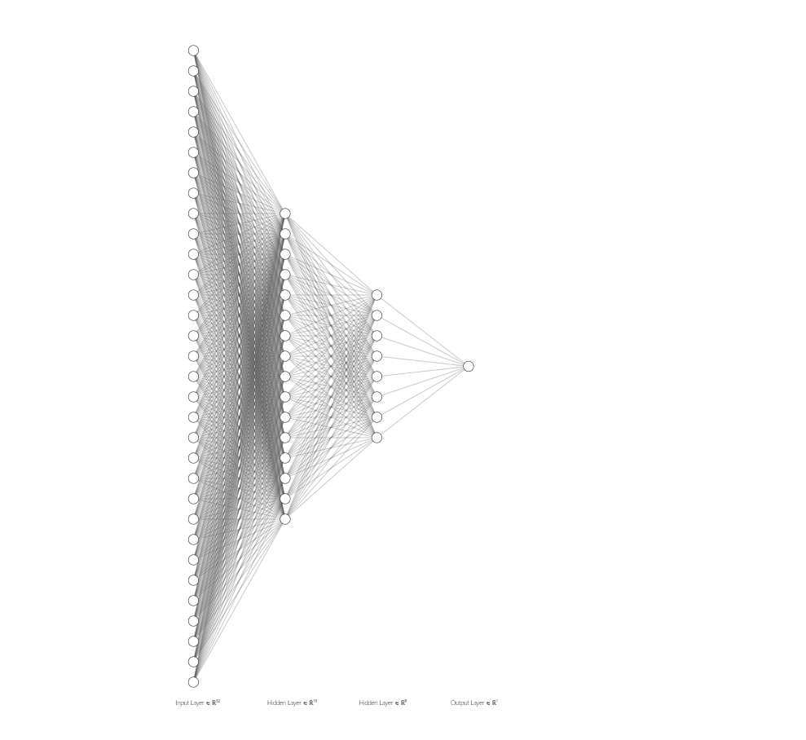
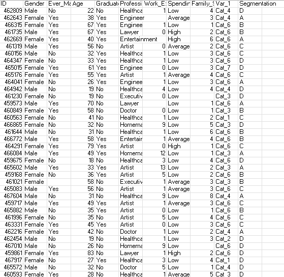
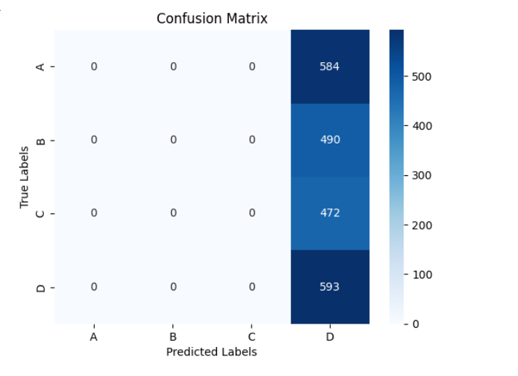
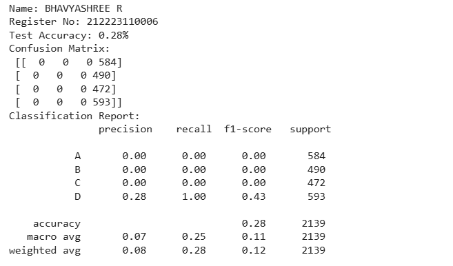
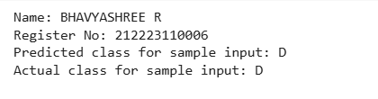

# Developing a Neural Network Classification Model

## AIM

To develop a neural network classification model for the given dataset.

## Problem Statement

An automobile company has plans to enter new markets with their existing products. After intensive market research, they’ve decided that the behavior of the new market is similar to their existing market.

In their existing market, the sales team has classified all customers into 4 segments (A, B, C, D ). Then, they performed segmented outreach and communication for a different segment of customers. This strategy has work exceptionally well for them. They plan to use the same strategy for the new markets.

You are required to help the manager to predict the right group of the new customers.

## Neural Network Model



## DESIGN STEPS

### STEP 1:
Data Preprocessing: Clean, normalize, and split data into training, validation, and test sets.
### STEP 2:
Input Layer: Number of neurons = features. Hidden Layers: 2 layers with ReLU activation. Output Layer: 4 neurons (segments A, B, C, D) with softmax activation.
### STEP 3:
Model Compilation: Use categorical crossentropy loss, Adam optimizer, and track accuracy.
### STEP 4:
Training: Train with early stopping, batch size (e.g., 32), and suitable epochs.
### STEP 5:
Model Compilation: Use categorical crossentropy loss, Adam optimizer, and track accuracy.
### STEP 6:
Training: Train with early stopping, batch size (e.g., 32), and suitable epochs.

## PROGRAM

### Name: BHAVYASHREE R
### Register Number: 212223110006

```python
class PeopleClassifier(nn.Module):
    def __init__(self, input_size):
        super(PeopleClassifier, self).__init__()
        self.fc1 = nn.Linear(input_size, 32)
        self.fc2 = nn.Linear(32, 16)
        self.fc3 = nn.Linear(16, 8) # This layer was defined but never used
        self.fc4 = nn.Linear(16, 4) # Changed input size to 16 to match fc2 output
       

    def forward(self, x):
        x = F.relu(self.fc1(x))
        x = F.relu(self.fc2(x))
        #x = F.relu(self.fc3(x)) # Adding this line to use fc3 and connect to fc4 properly
        x = self.fc4(x) # Now fc4 receives input of size 16 from fc2
        return x

```
```python
def train_model(model, train_loader, criterion, optimizer, epochs):
    model.train()
    for epoch in range(epochs):
        for inputs, labels in train_loader:
            optimizer.zero_grad()
            outputs = model(inputs)
            loss = criterion(outputs, labels)
            loss.backward()
            optimizer.step()

    if (epoch + 1) % 10 == 0:
        print(f'Epoch [{epoch+1}/{epochs}], Loss: {loss.item():.4f}')
```
## Dataset Information


## OUTPUT

### Confusion Matrix


### Classification Report


### New Sample Data Prediction


## RESULT
The development of a neural network classification model for the given dataset is executed successfully.
